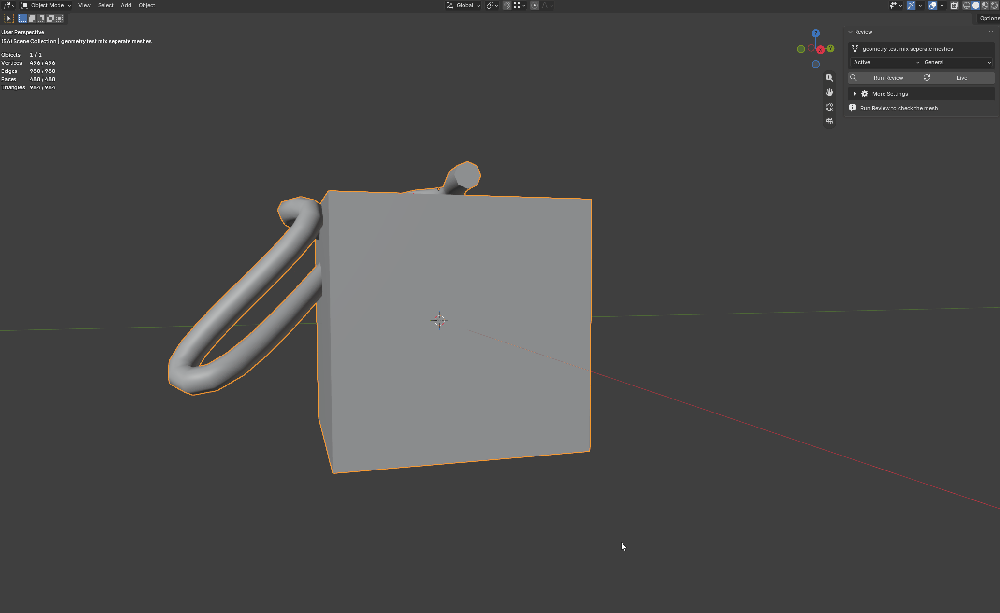
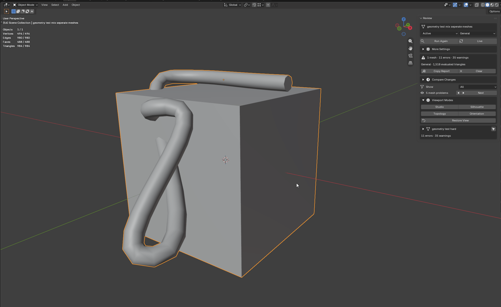

<p align="center">
  
</p>

<h1 align="center">Onyx Suite Free</h1>

<p align="center">
  <strong>A shared foundation for focused Blender tools.</strong><br>
  Free, open-source tools built around safe workflows and honest feedback.
</p>

<p align="center">
  <a href="https://github.com/Idi0tDev/onyx-suite-free/actions/workflows/ci.yml"></a>
  
  
  
</p>

<p align="center">
  <a href="#download-onyx-suite-free"></a>
</p>

<p align="center">
  <strong>Choose the tool you need · Ready-to-install Blender ZIPs</strong><br>
  Every Onyx product includes the Core runtime it needs.
</p>

## Download Onyx Suite Free

Each Onyx tool has its own ZIP so Blender can install and update it cleanly.
Most artists only need Reviewer:

- **[Download Onyx Reviewer 0.15.0](https://github.com/Idi0tDev/onyx-suite-free/releases/download/v0.15.0/onyx_reviewer-0.15.0.zip)** — inspect meshes and see problems directly in the viewport. Core is included.
- **[Download Onyx Core 0.1.0](https://github.com/Idi0tDev/onyx-suite-free/releases/download/v0.15.0/onyx_core-0.1.0.zip)** — optional standalone framework diagnostics for developers.

New free Onyx addons will get their own direct download here. If this is your
first Blender extension, follow the [Reviewer install steps](#install-onyx-reviewer).

## What's in this repository

Onyx Suite Free currently contains two closely connected projects:

- **Onyx Core** gives Onyx tools a shared foundation for startup, diagnostics,
  compatibility, and communication.
- **Onyx Reviewer** helps artists find, understand, and revisit mesh problems.

You can install Reviewer by itself. Its ZIP already contains the Core runtime it
needs, so there is no extra dependency to set up.

## Onyx Core

<p align="center">
  
</p>

<p align="center"><em>The common foundation behind Onyx tools. This public repository currently includes Reviewer and the optional standalone Core extension.</em></p>

Every Onyx product is self-contained. Onyx Reviewer bundles the generated
**Onyx Core** runtime, so artists do not install a separate dependency.

The standalone Core extension in this repository is free and optional. It
provides the same lifecycle, readiness, discovery, and diagnostics contract used
inside Reviewer, while staying out of the artist's workspace.

Read the [Core developer guide](onyx_core/docs/DEVELOPER_GUIDE.md) for the public
framework contract.

## Onyx Reviewer

<p align="center">
  
</p>

<p align="center"><em>Mesh analysis and diagnostics, with the problem areas pointed out on the model.</em></p>

**Onyx Reviewer** is a reversible mesh-inspection workspace for Blender 5.2 LTS.
It gives artists a clear answer to three everyday questions:

- What did my modifier stack do to the final geometry?
- Which topology or transform conditions deserve attention?
- Can I inspect the model clearly without disturbing my working setup?

Select a mesh, run a review, and get a compact report covering source geometry,
evaluated geometry, common topology concerns, transforms, UVs, materials, and an
optional triangle budget. Nothing is repaired automatically and no mesh data is
changed behind your back.

When you want the panel to follow an active modeling pass, enable **Live
Review**. It waits for mesh changes to settle, then refreshes the same findings
without touching geometry. It works in Object Mode and Edit Mode without
changing the active mode or selection, and pauses when the chosen scope exceeds
its configurable source-vertex limit.

### See it in action

**Find a problem and learn what to do next.** Run a review to see the problem
areas in their own colors, then hover over one for a practical fix suggestion.

<p align="center">
  
</p>

**Keep checking while you model.** Live Review follows Edit Mode changes and
removes a highlight as soon as that problem is gone.

<p align="center">
  
</p>

**Look at the mesh a few different ways.** Switch between the built-in viewport
modes for form, silhouette, topology, and face direction, then restore your
original view in one click.

<p align="center">
  
</p>

### Choose the right review

Review profiles keep early modeling checks useful without treating unfinished
UVs or materials as mistakes:

- **General** runs every finding group.
- **While Modeling** focuses on topology and transforms.
- **Topology Only** keeps the review on mesh structure.
- **Custom** lets you switch topology, transforms, UVs and materials, and the
  triangle budget on or off yourself.

Changing the profile clears an old Review Delta baseline, because comparing two
different sets of checks could look like the mesh improved when only the review
rules changed.

Open meshes and ngons are not automatically mistakes. If they are intentional
for a particular asset, open **More Settings > Topology Allowances** and enter
how many open boundary edges or ngons are acceptable. Both values start at zero,
so the default review remains strict. The warning is hidden only while the
actual count stays inside your allowance; the mesh statistics are still there.

### A typical review

1. Choose the active object, current selection, or active collection.
2. Choose a review profile.
3. Press **Run Review**.
4. Read per-object findings and compare base versus evaluated triangles.
5. Focus the list on **All**, **Errors**, **Warnings**, **On Mesh**, or recent
   **Changes**.
6. Optionally enable **Live Review** while iterating on the model.
7. Expand an object only when you want its findings or tools.
8. Use **Next** to walk through visible mesh problems without hunting through
   the list.
9. Use **Show Problems** for an overview, or **Show** to isolate one finding.
10. Use **Inspect** when you want its mesh elements selected in Edit Mode.
11. Press **Guide** for a recommended fix method. Reviewer never changes the mesh.
12. Open **Viewport Modes** to switch between Studio, Silhouette, Topology, and
    Face Orientation views.
13. Press **Restore View** to return the viewport to its original settings.

### Check what changed

**Review Delta** gives you a simple before-and-after check:

1. Run Review on the mesh you want to track.
2. Press **Save Baseline**. Think of the baseline as your before snapshot.
3. Keep modeling and use a finding's Guide when you need a suggested next step.
4. Run Review again.

Onyx now shows which findings are new, which ones are gone, which counts
changed, and how the evaluated triangle total moved. Use **Changes** in Finding
View to focus on new or changed problems, or **Copy Delta** to share the full
comparison.

The baseline lives only in the current Blender session. It is not written into
the mesh or saved inside the `.blend` file.

### What it currently checks

| Area | Review evidence |
| --- | --- |
| Geometry | Base and evaluated vertices, faces, and triangles; triangle, quad, and ngon face composition |
| Topology | Boundaries, non-manifold edges, duplicate, overlapping, or degenerate faces, local normal-direction outliers, coincident vertices, disconnected islands, loose geometry, ngons, inconsistent winding, optional boundary/ngon allowances, and 3/5/6+ edge pole counts |
| Transforms | Negative transforms and unapplied scale |
| Asset setup | UV-map and material-slot presence |
| Budget | Optional evaluated triangle warning |

Findings describe facts rather than pretending every warning is universally
wrong. An open boundary may be a mistake on a closed prop and completely valid
on a card, cloth panel, or trim sheet.

Actionable topology findings can select their exact vertices, edges, or faces
in Edit Mode. This navigation changes the active selection for inspection but
does not alter the mesh.

The compact problem navigator steps through those visual findings with previous
and next controls. It follows the active **Show** filter, selects the matching
object, opens its result card, and draws the correct color-coded evidence. It
wraps from the last problem back to the first, which makes a full review pass
easy even across several selected objects.

The compact **Show** menu keeps dense results readable without hiding evidence
for good. Switch between every finding, errors, warnings, problems Reviewer can
point out on the mesh, or findings that changed since your saved baseline. The
viewport overview follows the active view, while topology maps stay independent
and **Copy Report** always includes the complete review.

Every finding has a short **Guide** with a sensible way to approach it. These
are recommendations, not automatic repairs: you stay in control of topology,
transforms, UVs, materials, and intentional exceptions.

They can also draw temporary, color-coded highlights directly in the 3D
Viewport. Each problem type has a distinct color, while error-level findings use
thicker marks. Show a single finding or every actionable finding for one object
at once. A matching color dot beside every drawable result makes it easy to
connect the list to the mesh without memorizing color names. Highlights remain
visible through the surface and create no scene data. Rest the pointer over a
colored problem in the viewport to see its name and recommended fix method.
During Live Review, the visible highlight or map is rebuilt from the changed
mesh so it stays useful without becoming stale. Reviewer reuses the evidence
from that same review pass, avoiding a second mesh scan just to redraw the
colors. It disappears when its problem is resolved, it is hidden or cleared,
or the extension is disabled.

**Topology Tools** turns the descriptive statistics into navigation. Use a
face map to distinguish quads, triangles, and ngons, or a pole map to locate
3-edge, 5-edge, and 6+-edge vertices. Every class can also be highlighted alone
or selected exactly in Edit Mode.

### Built to leave the scene alone

Onyx Reviewer is intentionally an inspection tool—not a cleanup button.

- No automatic mesh repair
- No geometry edits from Live Review
- No hole filling, remeshing, vertex merging, or transform application
- No material replacement
- No export or pipeline assumptions
- No downloads, accounts, telemetry, or background network access
- No permanent viewport changes

The first review mode used in a viewport captures its settings. **Restore View**
returns them exactly, and disabling the extension restores any remaining saved
viewports.

## Install Onyx Reviewer

**[Download Onyx Reviewer 0.15.0](https://github.com/Idi0tDev/onyx-suite-free/releases/download/v0.15.0/onyx_reviewer-0.15.0.zip)**

That is the ready-to-install add-on. Onyx Core is already included, so you do
not need to download anything else.

1. Download the ZIP and leave it packed.
2. In Blender, open **Edit → Preferences → Get Extensions**.
3. Open the menu in the top-right and choose **Install from Disk**.
4. Pick `onyx_reviewer-0.15.0.zip` and confirm the installation.
5. Open **Onyx → Review** in the 3D Viewport sidebar.

Older versions and their checksums stay available on the repository's
[Releases](https://github.com/Idi0tDev/onyx-suite-free/releases) page.

Developers who want to build the current source can use a clean Git checkout:

```powershell
tools/package_reviewer.ps1
```

The package is written to `dist/onyx_reviewer-x.y.z.zip`.

Onyx Reviewer targets Blender 5.2 LTS on Windows, macOS, and Linux. It is
pure Python and asks only for clipboard access so **Copy Report** and **Copy
Delta** can put their plain-text summaries on your clipboard. It does not need
network or file access.

For complete controls and interpretation guidance, see the
[Onyx Reviewer user guide](onyx_reviewer/docs/USER_GUIDE.md).

For the reasoning behind the architecture and safety boundaries, read the
[engineering case study](docs/ENGINEERING_CASE_STUDY.md). Installation and
workflow answers are collected in [Troubleshooting and FAQ](docs/TROUBLESHOOTING.md).

## Quality is part of the product

The repository includes:

- UI-neutral result and aggregation tests
- Real Blender mesh-analysis smoke tests
- Vertex, edge, and face finding-selection coverage
- Finding-color uniqueness and face/pole statistic coverage
- Face-map, pole-map, and topology-class selection coverage
- Transient viewport-highlight geometry and cleanup coverage
- Empty-scope readiness and clipboard-report coverage
- Debounced Live Review in Object and Edit Mode, single-pass evidence reuse,
  plus density-limit coverage
- Finding-view filtering and matching viewport-overview coverage
- Review-profile presets, custom finding groups, and comparison invalidation coverage
- Session-only Review Delta comparison, filtering, reporting, and cleanup coverage
- Explicit quick-fix mutation, refusal, and result-refresh coverage
- Viewport restoration coverage
- Core embedding verification
- Standalone Core and bundled-product coexistence tests
- Manifest and runtime version consistency checks
- Public-source leakage checks
- Deterministic extension packaging, archive inspection, and SHA-256 checksums
- Native Blender validation of the finished extension ZIPs
- Tag-driven draft releases with manual publication

Run the local suite with Blender 5.2 and its bundled Python:

```powershell
tools/test.ps1
```

Maintainers can build the complete verified release candidate with:

```powershell
tools/build_release.ps1
tools/validate_release.ps1
```

The full release gate is documented in [RELEASING.md](RELEASING.md).

## License

The source code is licensed under [GNU GPL 3.0 or later](LICENSE).
