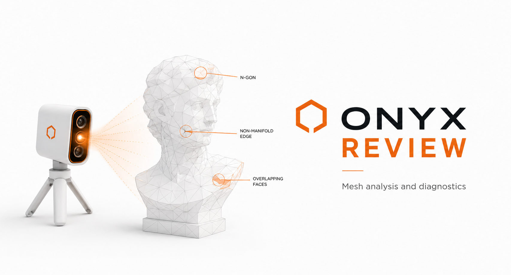
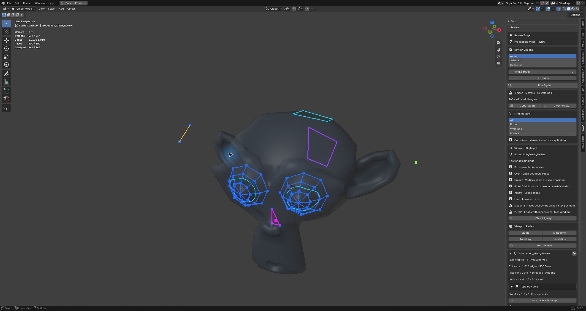
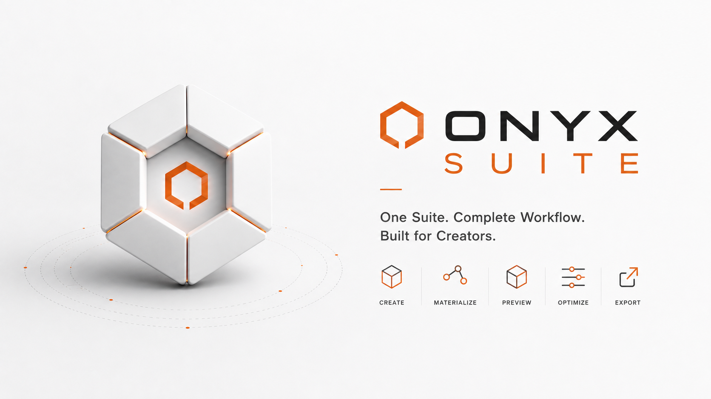

<p align="center">
  
</p>

<h1 align="center">Onyx Suite Free</h1>

<p align="center">
  <strong>A shared foundation for focused Blender tools.</strong><br>
  Free, open-source tools built around safe workflows and honest feedback.
</p>

<p align="center">
  <a href="https://github.com/Idi0tDev/onyx-suite-free/actions/workflows/ci.yml"></a>
  
  
  
</p>

## What's in this repository

Onyx Suite Free currently contains two closely connected projects:

- **Onyx Review** helps artists find, understand, and revisit mesh problems.
- **Onyx Core** gives Onyx tools a shared foundation for startup, diagnostics,
  compatibility, and communication.

You can install Review by itself. Its ZIP already contains the Core runtime it
needs, so there is no extra dependency to set up.

## Onyx Review

<p align="center">
  
</p>

<p align="center"><em>Mesh analysis and diagnostics, with the problem areas pointed out on the model.</em></p>

<p align="center">
  
</p>

<p align="center"><em>A real Blender 5.2 LTS capture: one review, distinct problem colors, and the full evidence legend beside the mesh.</em></p>

**Onyx Review** is a reversible mesh-inspection workspace for Blender 5.2 LTS.
It gives artists a clear answer to three everyday questions:

- What did my modifier stack do to the final geometry?
- Which topology or transform conditions deserve attention?
- Can I inspect the model clearly without disturbing my working setup?

Select a mesh, run a review, and get a compact report covering source geometry,
evaluated geometry, common topology concerns, transforms, UVs, materials, and an
optional triangle budget. Nothing is repaired automatically and no mesh data is
changed behind your back.

When you want the panel to follow an active modeling pass, enable **Live
Review**. It waits for mesh changes to settle, then refreshes the same findings
without touching geometry. Live Review pauses while a target is in Edit Mode or
when the chosen scope exceeds its configurable source-vertex limit.

### A typical review

1. Choose the active object, current selection, or active collection.
2. Press **Run Review**.
3. Read per-object findings and compare base versus evaluated triangles.
4. Focus the list on **All**, **Errors**, **Warnings**, **Fixable**, or recent
   **Changes**.
5. Optionally enable **Live Review** while iterating on the model.
6. Open **Topology Detail** to map or select face types and topology poles.
7. Use **Show Visible Findings** for an overview, or **Show** to isolate one finding.
8. Use **Inspect** when you want its mesh elements selected in Edit Mode.
9. Optionally use **Fix** for supported, deterministic cleanup cases.
10. Switch between Studio, Silhouette, Topology, and Face Orientation views.
11. Press **Restore View** to return the viewport to its original settings.

### Check what changed

**Review Delta** gives you a simple before-and-after check:

1. Run Review on the mesh you want to track.
2. Press **Save Baseline**. Think of the baseline as your before snapshot.
3. Keep modeling, or use one of the supported simple fixes.
4. Run Review again.

Onyx now shows which findings are new, which ones are gone, which counts
changed, and how the evaluated triangle total moved. Use **Changes** in Finding
View to focus on new or changed problems, or **Copy Delta** to share the full
comparison.

The baseline lives only in the current Blender session. It is not written into
the mesh or saved inside the `.blend` file.

### What it currently checks

| Area | Review evidence |
| --- | --- |
| Geometry | Base and evaluated vertices, faces, and triangles; triangle, quad, and ngon face composition |
| Topology | Boundaries, non-manifold edges, duplicate or degenerate faces, coincident vertices, disconnected islands, loose geometry, ngons, inconsistent winding, and 3/5/6+ edge pole counts |
| Transforms | Negative transforms and unapplied scale |
| Asset setup | UV-map and material-slot presence |
| Budget | Optional evaluated triangle warning |

Findings describe facts rather than pretending every warning is universally
wrong. An open boundary may be a mistake on a closed prop and completely valid
on a card, cloth panel, or trim sheet.

Actionable topology findings can select their exact vertices, edges, or faces
in Edit Mode. This navigation changes the active selection for inspection but
does not alter the mesh.

**Finding View** keeps dense results readable without hiding evidence for good.
Switch between every finding, errors, warnings, supported simple fixes, or
findings that changed since your saved baseline. The viewport overview follows
the active view, while topology maps stay independent and **Copy Report** always
includes the complete review.

Four deliberately narrow findings also offer an explicit **Fix** action:
inconsistent winding, exact duplicate faces, loose edges, and loose vertices.
Each action changes only the base mesh, creates one Blender undo step, and
immediately reruns the review. Fixes are never run automatically, and Onyx
refuses them on linked, shared, or shape-key mesh data.

They can also draw temporary, color-coded highlights directly in the 3D
Viewport. Each problem type has a distinct color, while error-level findings use
thicker marks. Show a single finding or every actionable finding for one object
at once. Highlights remain visible through the surface, create no scene data,
and clear when the review is rerun, cleared, hidden, or the extension is
disabled.

**Topology Detail** turns the descriptive statistics into navigation. Use a
face map to distinguish quads, triangles, and ngons, or a pole map to locate
3-edge, 5-edge, and 6+-edge vertices. Every class can also be highlighted alone
or selected exactly in Edit Mode.

### Built to leave the scene alone

Onyx Review is intentionally an inspection tool—not a cleanup button.

- No automatic mesh repair
- No geometry edits from Live Review
- No hole filling, remeshing, vertex merging, or transform application
- No material replacement
- No export or pipeline assumptions
- No downloads, accounts, telemetry, or background network access
- No permanent viewport changes

The first review mode used in a viewport captures its settings. **Restore View**
returns them exactly, and disabling the extension restores any remaining saved
viewports.

## Onyx Core

<p align="center">
  
</p>

<p align="center"><em>The common foundation behind Onyx tools. This public repository currently includes Review and the optional standalone Core extension.</em></p>

Every Onyx product is self-contained. Onyx Review bundles the generated
**Onyx Core** runtime, so artists do not install a separate dependency.

The standalone Core extension in this repository is free and optional. It
provides the same lifecycle, readiness, discovery, and diagnostics contract used
inside Review, while staying out of the artist's workspace.

Read the [Core developer guide](onyx_core/docs/DEVELOPER_GUIDE.md) for the public
framework contract.

## Install Onyx Review

For a tagged release, download `onyx_review-x.y.z.zip` from the repository's
[Releases](https://github.com/Idi0tDev/onyx-suite-free/releases) page. Install
the ZIP without unpacking it through:

**Edit → Preferences → Get Extensions → Install from Disk**

To build the current source instead, use a clean Git checkout:

```powershell
tools/package_review.ps1
```

The package is written to `dist/onyx_review-x.y.z.zip`.

Then open **Onyx → Review** in the 3D Viewport sidebar.

Onyx Review targets Blender 5.2 LTS on Windows, macOS, and Linux. It is
pure Python and requests no extension permissions.

For complete controls and interpretation guidance, see the
[Onyx Review user guide](onyx_review/docs/USER_GUIDE.md).

For the reasoning behind the architecture and safety boundaries, read the
[engineering case study](docs/ENGINEERING_CASE_STUDY.md). Installation and
workflow answers are collected in [Troubleshooting and FAQ](docs/TROUBLESHOOTING.md).

## Quality is part of the product

The repository includes:

- UI-neutral result and aggregation tests
- Real Blender mesh-analysis smoke tests
- Vertex, edge, and face finding-selection coverage
- Finding-color uniqueness and face/pole statistic coverage
- Face-map, pole-map, and topology-class selection coverage
- Transient viewport-highlight geometry and cleanup coverage
- Empty-scope readiness and clipboard-report coverage
- Debounced Live Review, Edit Mode pause, and density-limit coverage
- Finding-view filtering and matching viewport-overview coverage
- Session-only Review Delta comparison, filtering, reporting, and cleanup coverage
- Explicit quick-fix mutation, refusal, and result-refresh coverage
- Viewport restoration coverage
- Core embedding verification
- Standalone Core and bundled-product coexistence tests
- Public-source leakage checks
- Deterministic extension packaging, archive inspection, and SHA-256 checksums
- Tag-driven draft releases with manual publication

Run the local suite with Blender 5.2 and its bundled Python:

```powershell
tools/test.ps1
```

Maintainers can build the complete verified release candidate with:

```powershell
tools/build_release.ps1
```

The full release gate is documented in [RELEASING.md](RELEASING.md).

## License

The source code is licensed under [GNU GPL 3.0 or later](LICENSE).
