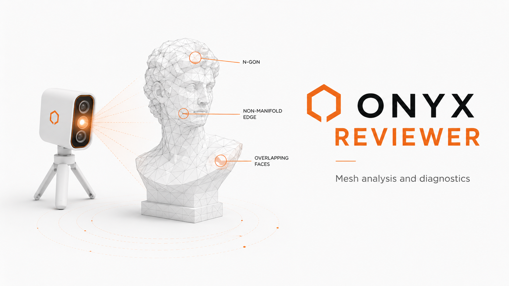
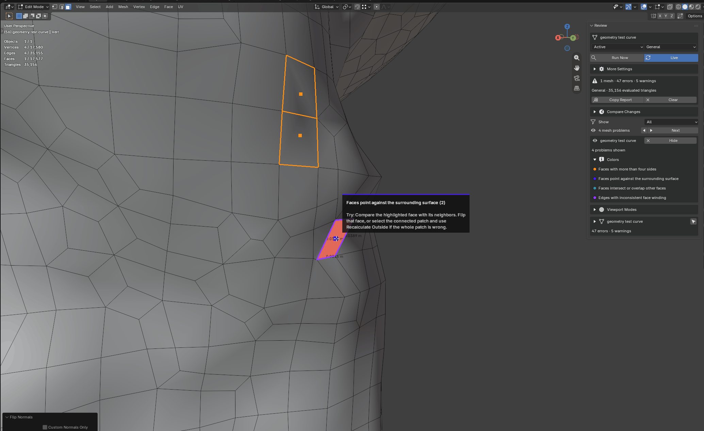

<p align="center">
  
</p>

<h1 align="center">Onyx Suite Free</h1>

<p align="center">
  <strong>Small, focused Blender tools built on one shared foundation.</strong><br>
  Free, open source, and designed to stay out of your way.
</p>

<p align="center">
  <a href="https://github.com/Idi0tDev/onyx-suite-free/actions/workflows/ci.yml"></a>
  
  
  
</p>

<p align="center">
  <a href="#download-onyx-suite-free"></a>
</p>

## Download Onyx Suite Free

Pick the tool you want and install its ZIP directly in Blender. Each Onyx addon
includes the Core runtime it needs, so there is no dependency puzzle.

- **[Download Onyx Reviewer 0.15.0](https://github.com/Idi0tDev/onyx-suite-free/releases/download/v0.15.0/onyx_reviewer-0.15.0.zip)** — find mesh problems and see them on the model.
- **[Download Onyx Core 0.1.0](https://github.com/Idi0tDev/onyx-suite-free/releases/download/v0.15.0/onyx_core-0.1.0.zip)** — optional standalone diagnostics for the shared framework.

All versions, checksums, and release notes are kept on the
[Releases](https://github.com/Idi0tDev/onyx-suite-free/releases) page. Future
free Onyx addons will get their own direct download in this section.

## Onyx Core

<p align="center">
  
</p>

Core is the common foundation behind Onyx tools. It handles startup,
compatibility, diagnostics, and safe communication between products.

- Every Onyx product bundles the Core runtime it needs.
- Artists do not have to install Core separately.
- The standalone Core download is useful for framework diagnostics and addon
  development.

**[Open the Core product page](onyx_core/README.md)** ·
**[Read the developer guide](onyx_core/docs/DEVELOPER_GUIDE.md)** ·
**[Download Core](https://github.com/Idi0tDev/onyx-suite-free/releases/download/v0.15.0/onyx_core-0.1.0.zip)**

## Onyx Reviewer

<p align="center">
  
</p>

Reviewer checks editable and modifier-evaluated meshes, explains what it finds,
and points to useful evidence directly in Blender's 3D Viewport. It does not
repair, remesh, or otherwise change your geometry.

- Color-coded highlights make different problem types easy to tell apart.
- Hover guides suggest a practical way to approach each problem.
- Live Review follows Object Mode and Edit Mode changes after they settle.
- Review Delta shows what appeared, changed, or disappeared since a baseline.
- Viewport modes help inspect form, silhouette, topology, and face direction.

<p align="center">
  
</p>

**[Open the Reviewer product page](onyx_reviewer/README.md)** ·
**[Read the user guide](onyx_reviewer/docs/USER_GUIDE.md)** ·
**[Download Reviewer](https://github.com/Idi0tDev/onyx-suite-free/releases/download/v0.15.0/onyx_reviewer-0.15.0.zip)**

## Install Onyx Reviewer

1. Download the Reviewer ZIP above and leave it packed.
2. In Blender, open **Edit → Preferences → Get Extensions**.
3. Open the menu in the top-right and choose **Install from Disk**.
4. Pick `onyx_reviewer-0.15.0.zip` and confirm the installation.
5. Open **Onyx → Review** in the 3D Viewport sidebar.

That is it. Core is already inside the Reviewer package.

## Repository map

| Path | What is there |
| --- | --- |
| [`onyx_core/`](onyx_core) | The public framework and optional standalone extension |
| [`onyx_reviewer/`](onyx_reviewer) | The Reviewer extension, product page, and user guide |
| [`docs/`](docs) | Shared project notes, troubleshooting, and artwork |
| [`tests/`](tests) | Pure Python and real-Blender checks |
| [`tools/`](tools) | Public packaging and validation helpers |

## Contributing and support

Found a bug or have a focused idea? Open an
[issue](https://github.com/Idi0tDev/onyx-suite-free/issues). Please include your
Blender version, the Onyx version, what you expected, and a small reproduction
when possible.

### Support the flock 🐔

Onyx stays free. If it saves you some time and you feel the urge to support
future updates, here is a photo of my chickens—the tiny support crew you are
supporting:

<p align="center">
  
</p>

They contribute nothing to the codebase, ignore release schedules, and remain
deeply committed to the feed budget.

**[Support free Onyx addons on Gumroad](https://idi0tdev.gumroad.com/l/onyx-suite-free)**

<details>
<summary><strong>Testing</strong></summary>

The repository tests the Core framework, Reviewer analysis and profiles,
viewport evidence, Live Review, Core embedding, product coexistence, manifests,
and Blender validation of the finished ZIP files.

Run the full local suite with Blender 5.2 and its bundled Python:

```powershell
tools/test.ps1
```

</details>

<details>
<summary><strong>Why Core is bundled</strong></summary>

Blender extensions work best when they are self-contained. Each Onyx product
therefore carries a generated copy of the same Core runtime. Compatible copies
meet through a versioned broker instead of importing code from another installed
addon. This keeps installation simple while still allowing Onyx products to
cooperate.

The standalone Core extension joins that same broker and adds diagnostics. It
does not create a second competing runtime.

</details>

## License

The source code is licensed under [GNU GPL 3.0 or later](LICENSE).
